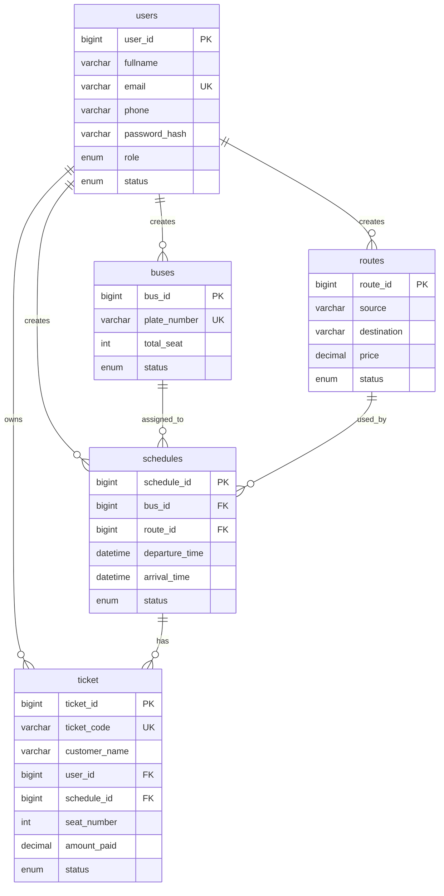

# ERD Summary

```mermaid
erDiagram
  users ||--o{ buses : creates
  users ||--o{ routes : creates
  users ||--o{ schedules : creates
  users ||--o{ ticket : owns
  buses ||--o{ schedules : assigned_to
  routes ||--o{ schedules : used_by
  schedules ||--o{ ticket : has

  users {
    bigint user_id PK
    varchar fullname
    varchar email UK
    varchar phone
    varchar password_hash
    enum role
    enum status
  }
  buses {
    bigint bus_id PK
    varchar plate_number UK
    int total_seat
    enum status
  }
  routes {
    bigint route_id PK
    varchar source
    varchar destination
    decimal price
    enum status
  }
  schedules {
    bigint schedule_id PK
    bigint bus_id FK
    bigint route_id FK
    datetime departure_time
    datetime arrival_time
    enum status
  }
  ticket {
    bigint ticket_id PK
    varchar ticket_code UK
    varchar customer_name
    bigint user_id FK
    bigint schedule_id FK
    int seat_number
    decimal amount_paid
    enum status
  }
```
